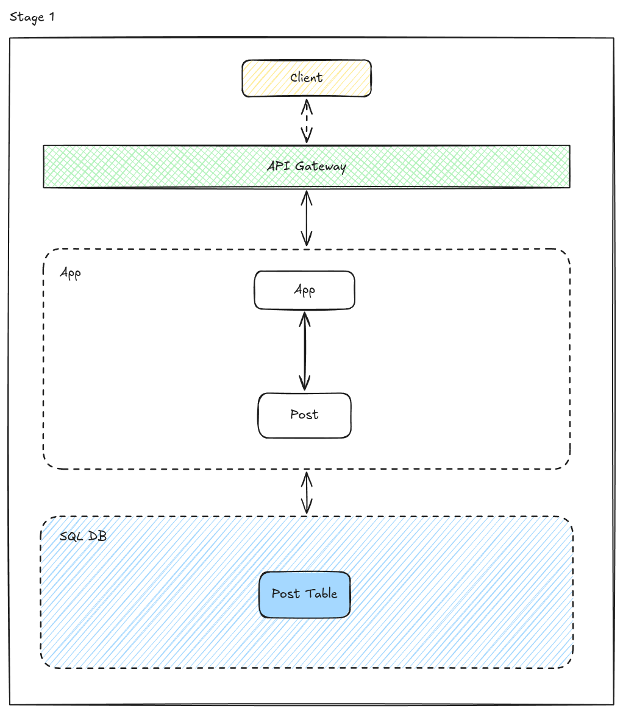
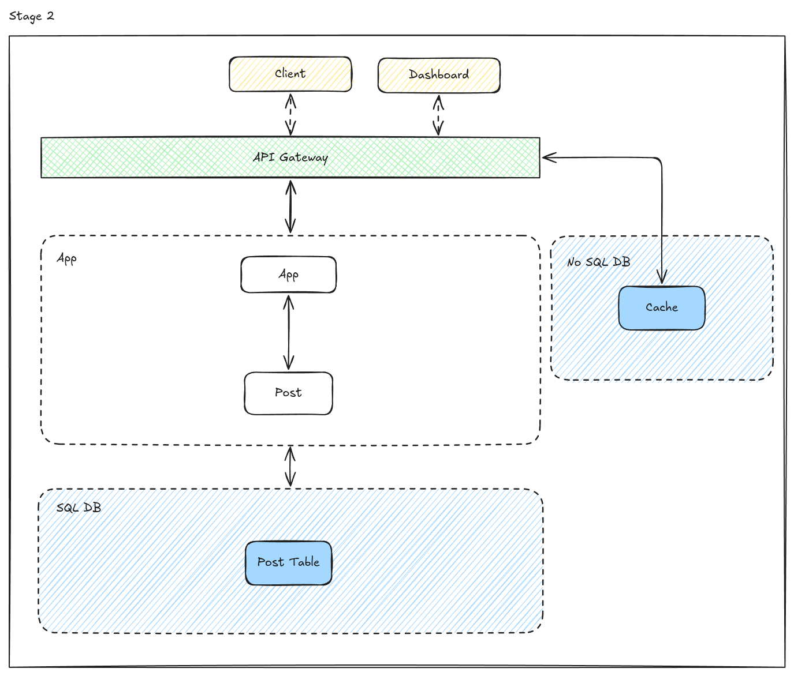
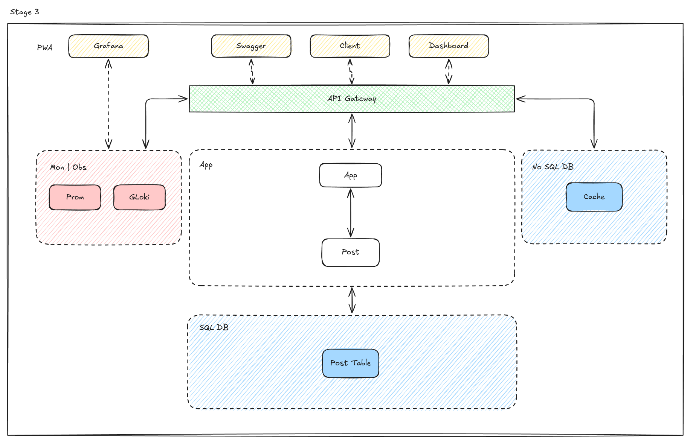

# NikoSyb

NikoSyb - блог фронт + бэк, фронт на Next Js + TS, бэк на Go + Gin, Gorm. Идея, хранить в бд посты с текстом MarkDown, передавать его через API, парсить на фронте и рендерить.

## Структура
```text
.
├── docker        -- Композ файлы
├── images        -- Изображения для README.md
├── nginx         -- Конфигурации nginx и (опционально) ключ с сертификатом
├── post-service  -- Сервис постов
├── user-client   -- Пользовательский клиент
└── README.md     -- Вы сейчас здесь  
```

## Запуск

- Склонируйте репозиторий

```sh
git clone https://github.com/Nikolay-Yakunin/NikoSyb.git
cd NikoSyb
```

### В режиме разработки

1) Скопируйте переменные окружения
```sh
cp user-client/env/.env.dev user-client/.env
cp post-service/env/.env.dev post-service/.env
```

2) Запустите docker-compose 
```sh
docker-compose -f docker/compose.dev.yaml up
```

3) Перейдите на ```http://localhost```
```sh
open http://localhost
```

### В режиме продакшена

1) Поместите ваш ключ и сертификат в ```nginx/ssl```

2) Замените ```your_cert.pem``` и ```your_private_key.pem``` в конфигурации nginx

```nginx/prod.conf``` 
```conf
server_name example.com; # Replace with your domain

ssl_certificate /etc/nginx/ssl/your_cert.pem; # Replace with your cert
ssl_certificate_key /etc/nginx/ssl/your_private_key.pem; # Replace with your key

ssl_protocols TLSv1.2 TLSv1.3;
```

3) Замените ```example.com``` на ваш домен

```nginx/prod.conf```
```conf
server {
    listen 80;
    server_name example.com; # Replace with your domain
    return 301 https://$host$request_uri;
}
...

server {
    listen 443 ssl;
    server_name example.com; # Replace with your domain

    ssl_certificate /etc/nginx/ssl/your_cert.pem; # Replace with your cert
...
```

3) Настройте ```.env.prod``` с учетом ваших данных
```
.
├── post-service
│   └─── env
│       └── .env.prod
└── user-client
    └─── env
        └── .env.prod 
```

4) Скопируйте переменные окружения
```sh
cp user-client/env/.env.prod user-client/.env
cp post-service/env/.env.prod post-service/.env
```

5) Запустите docker-compose 
```sh
docker-compose -f docker/compose.prod.yaml up
```

6) Теперь приложение доступно на вашем домене или на ```localhost```

## Планы

## stage 1
На первой стадии (release 1.0.0), я хочу реализовать пользовательский клиент, api gateway и сервис для постов. 

- Когда стадия будет достигнута?
  - Рабочее приложение
  - Настроенный CI
  - Удовлетворительное качество кода




## stage 2
На второй стадии (release 2.0.0), я хочу реализовать PWA для пользовательского клиента, и админ дашбоард, для управления контентом.

- Когда стадия будет достигнута?
  - Кеширование на стороне сервера и клиента
  - Полноценный CRUD для постов
  - Редактор MD в админке
  - В постах рендерятся изображения, так, как они и должны.
  - Использование паттернов



## stage 3
На финальной стадии (release 3.0.0), необходимо добавить мониторинг и протестировать приложение под нагрузкой. Также, необходимо провести рефакторинг кодовой базы.

- Когда стадия будет достигнута?
  - Добавлен мониторин
  - Приложение проходит нагрузочное тестирование
  - Код идеоматичен и использованы паттерны


